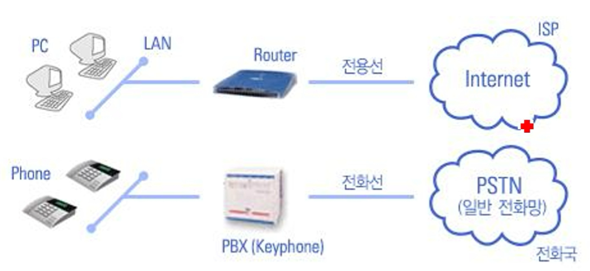
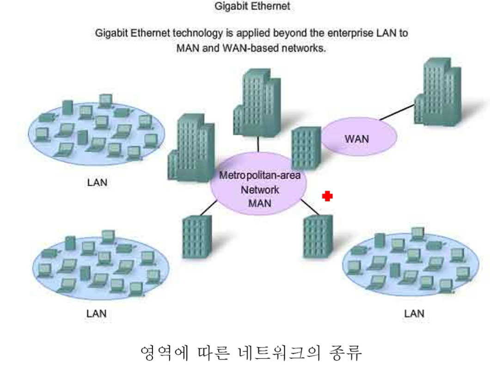
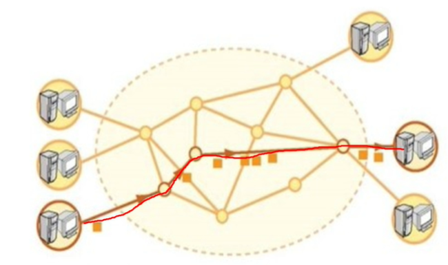
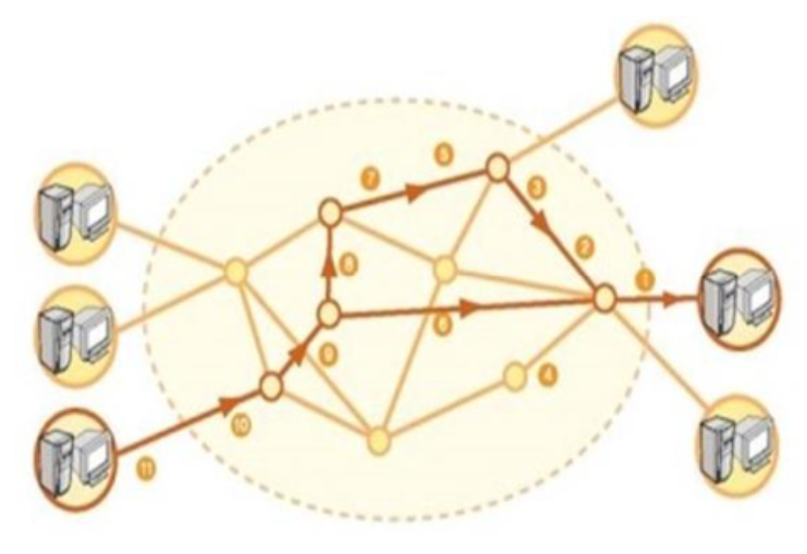
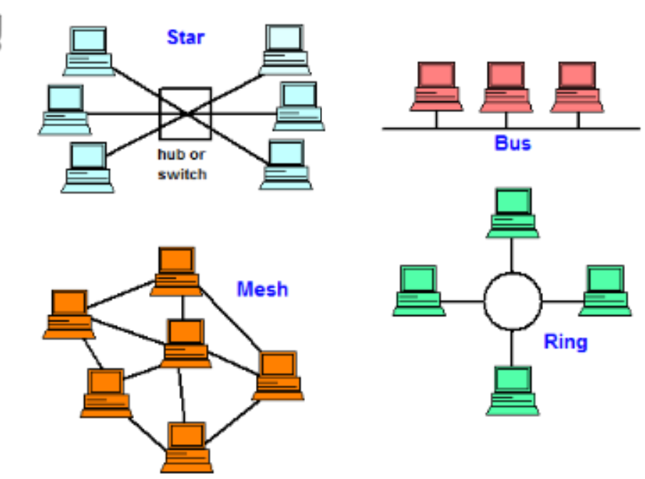
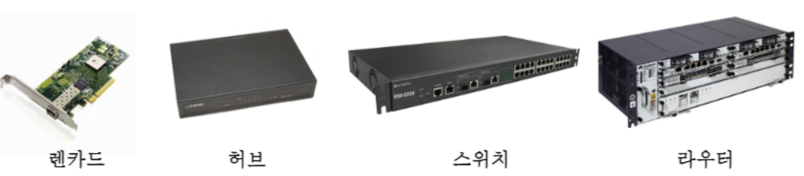
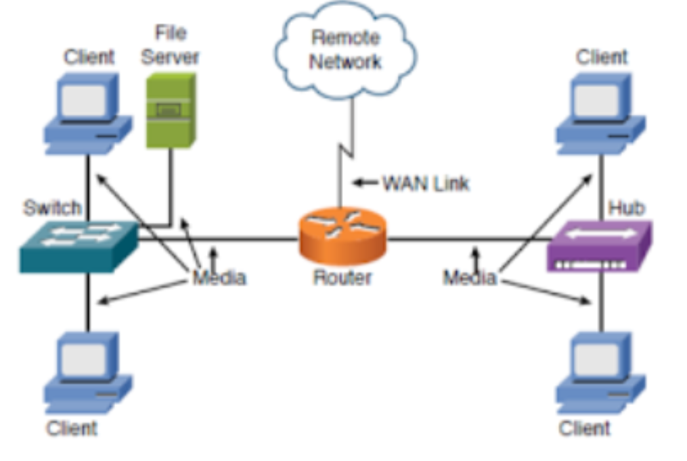
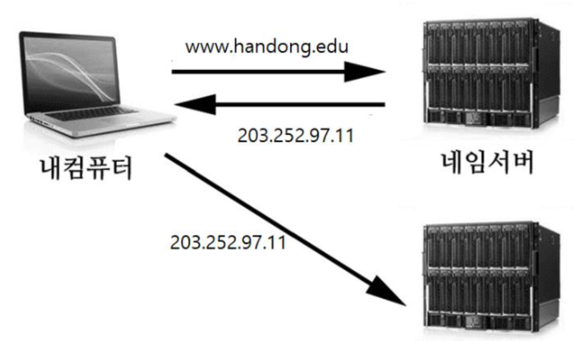
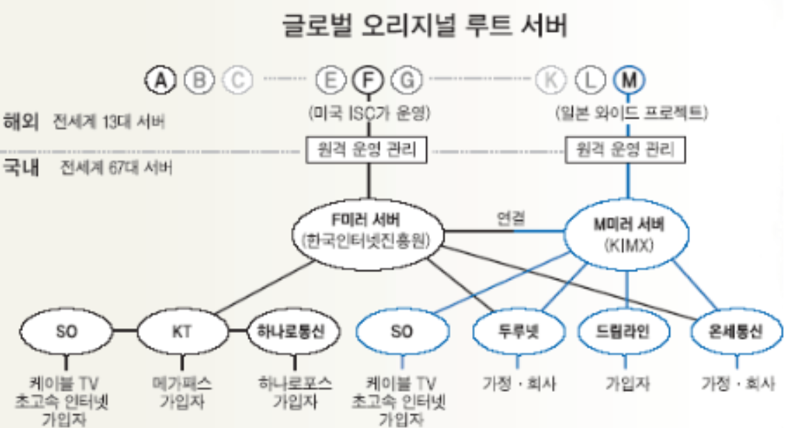

# 컴퓨터 통신망 & 인터넷의 개요

Content: Week 1
Assignment: Yes
Lecture: Yes
STATUS: Note

# 컴퓨터 통신망

## 컴퓨터 통신망의 이해

### 컴퓨터 통신망의 기본 이해

- ****************컴퓨터 통신망:**************** 컴퓨터 통신을 위해 연결된 컴퓨터들의 집합
    - **주소**: 데이터를 주고 받는 컴퓨터들의 위치 정보
    - **프로토콜(Protocol)**: 컴퓨터 통신을 하기 위한 규약
    - **케이블**: 정보 전송을 위한 물리적 통로
- **************인터넷:************** TCP/IP(프로토콜)를 통신규약으로 정보 교환을 하는 컴퓨터 네트워크

여러 가지 네트워크의 예

### 근거리 통신망, 원거리 통신망, 고속 백본

- ************************************************************근거리 통신망 (LAN: Local Area Network)************************************************************
    - 범위: 건물 내, 소규모 지역 (반경 수백 ~ 수천 미터)
    - 특성: 전송 속도가 빠르며 별도의 디지털 망을 구축
    - 예: 캠퍼스 내 와이파이, 건물 내 와이파이
- **********************도시통신망 (MAN: Metropolitan Area Network)**********************
    - 범위: 하나의 도시 (수많은 LAN으로 이루어진)
- ************************************원거리 통신망 (WAN: Wide Area Network)************************************
    - 범위: 수 Km 이상되는 광역 통신망
    - 예: 인터넷
- ********고속 백본 (High Speed Backbone)********
    - 네트워크의 최하위 레벨로써 ****************기간망****************이라고도 함.
    - 많은 LAN이나 WAN을 서로 연결하여 주는 초고속 망임

## 패킷 교환 방식

### 패킷 스위치 네트워크

- ****************************************교환방식 (Switching):**************************************** 정보가 오가는 경로를 정해 주는 방식

- ****************************************************회선 교환 (Circuit Switch) 방식****************************************************
    - 데이터 전송 전에 물리적 회선을 결정하고 독점적 사용하고 데이터 전송이 끝나면 돌려줌
    e.g. 전화
    1. 호출자와 수신자 사이를 연결하기 위해 네트워크의 전기적인 경로나 회선을 연결 (확립)
    2. 일단 연결되면 회선은 독립적으로 계속 사용 가능
        
        
        
        Circuit Switch 방식
        

- ******************************************패킷 교환 (Packet Switch) 방식******************************************
    - **패킷**: 전자 신호 중에 하나이며, 전송 정보에 주소와 제어 신호가 부가된 데이터 전송 단위
    ⇒ 목적지 주소로 정보를 전달해준다.
        
        
        | 목적지 주소(e.g. IP) | Information |
        | --- | --- |
    - 경로가 물리적으로 정해지지 않고, 패킷마다 다른 선로 이용 가능 → **********************************************전송로를 여러 소스가 공유하여 사용 가능**********************************************
    e.g. 우편
    - 선로의 독점 X, 데이터 손실이 드뭄
    - 인터넷에서 사용되는 방식 → fast & credible
        
        
        
        Packet Switch 방식
        

## 근거리 통신망(LAN)의 구조

- ******************************위상(Topology):****************************** 장비와 케이블의 연결 및 운영 형태

- ********************Star 형:******************** Host/terminal 형태로, **********호스트**********가 랜과 터미널을 제어함
- **************Ring형**************: ********Token Ring********이라는 제어 신호에 의해 랜 운영
- ****************Bus형:**************** 모든 장비가 ******Bus******라는 회선에 연결된 형태
- **********Tree 형: 트리구조**********의 위상
- ****************Mesh형:**************** 자신과 가장 가까이 있는 컴퓨터들과 연결 & 무선 네트워크에서 사용

### 통신 프로토콜(Protocol)

- 통신을 위한 통신 규약
e.g. A 컴퓨터에서 B 컴퓨터로 정보를 보낼 때 A가 압축, 편집, 암호를 해서 보낸다면 B 컴퓨터는 이를 같은 방식으로 압축 풀기, 붙이기, 해독을 해야 한다는 것
- 서로 다른 기종의 컴퓨터간의 데이터 교환을 위해
- 기능
    - 정보나 메시지를 동일한 크기로 나누고 재결합
    - 정보/메시지에 존재하는 에러 감시 & 제거
    - 통신을 하는 두 개체간 흐름 제어 및 연결 제어, 동기화
    - 여러 개의 메시지를 동시에 섞어 보내는 **다중화 (Multiplexing)**
- 프로토콜의 예시
    - TCP/IP: 인터넷
    - FTP(File transfer protocol): 파일 전송 & 업로드
    - SMTP(Simple Mail Transfer Protocol): 이메일
    - HTTP(Hyper Text Transfer Protocol): 웹서비스에서 문서 주고 받기
    - PPP & SLIP: 전화할 때 사용됨

## 네트워크 연결 장비

- **Lan Card**: **컴퓨터와 네트워크 간 인터페이스** 역할, PC에 주로 사용됨

- **Hub**: 접속 방법이 다른 물리층 (Pysical layer)를 서로 연결, 하나의 네트워크 케이블을 트리 구조로 연결 → **여러 대의 단말기와 연결**하는 용도 즉, 여러 컴퓨터를 랜선으로 연결

- ************Switch************: 스위치 허브 (Switch Hub)라고도 부름, 연결된 모든 노드가 **************동시에 데이터 전송************** 가능하게 해줌

- **Router**: 전달될 **패킷의 주소**를 읽어서 **가장 적절한 경로 지정**
- **Repeater**: 신호가 먼 거리를 이동할때 신호를 ********************증폭하여******************** 약해지는 것을 방지하고 먼 거리까지 정확한 신호 전달
- **Gateway: 프로토콜이 다른 네트워크들**을 서로 연결하는 장치

### 네트워크 장비 구성도

# 인터넷의 개요

## 인터넷의 개요 및 역사

### 인터넷

- 네트워크의 네트워크
- 전 세계에 퍼져 있는 컴퓨터 간에 정보를 공유하기 위해 컴퓨터와 통신망을 연결해놓은 최대의 컴퓨터 네트워크
- 가장 넓은 WAN

### **************************************인터넷의 특징**************************************

1. **멀티미디어** 정보의 **실시간** 교환 (문자, 수치, 그림, 음성, 동영상 등)
2. **이기종**(서로 다른 종류의 통신 기기) 간 통신 (TCP/IP 이용)
3. **쌍방향** 환경의 네트워크 (상호작용성)
4. **익명성** → 세계 규모의 개방적인 네트워크 (but 단속이나 규제 어려움)
5. **서버/클라이언트 모델**: 서버에서 필요한 정보를 검색하여 제공 받거나 서버에 요청하는 서비스 모델
    1. ****************************서버(server):**************************** 서비스를 제공하는 정보 공유용 컴퓨터
    2. **************************************클라이언트(Client):************************************** 서버가 제공하는 서비스를 이용하는 컴퓨터

### 인터넷의 역사

1. ****************ARPAnet (Advanced Research Project Agency net) - 1969년****************
    1. 미 국방성(DoD)에서 구축한 군사적 목적의 네트워크
    2. ****************************************************패킷 교환 방식 적용:**************************************************** 군사 시설의 독립성 & 통신 신뢰성 보장
    3. ************TCP/IP************ 적용: 위성, 케이블, 패킷 라디오 네트워크 상호 연결
2. ************************************************Ethernet Local Area Network************************************************의 활성화
    1. **워크스테이션의 보급 확대**로 이들의 연결 위해 개발
    2. **************UNIX O/S************** 적용 → IP를 기본적으로 지원해 ARPA net 연결
3. ****************************************************NSFnet (National Science Foundation net) - 1986년****************************************************
    1. 5개 지역에 산재된 미국립과학재단 소속의 ******슈퍼 컴퓨터 연결******
    2. 각 슈퍼컴퓨터 센터에서 인근의 대학/도서관/연구소 등 연결
    3. ********1995년********까지 미국내 인터넷 기간망으로 활용 **************************(ANSnet)**************************
4. **일반 상업적인 목적의 네트워크**가 연결 → 현재의 인터넷
- **발전 배경**
    - PC의 보급
    - WWW의 보급으로 인터넷 사용자의 증가
        - 웹 서비스 제공 정보 형태의 변화: 텍스트 → 멀티미디어
        - ********************************************Hypertext & Hypermedia********************************************가 발전
    - 인터넷의 ********************************************민간화 및 상업화********************************************
    - TCP/IP 프로토콜의 **********************************************개방성 & 독립성 →********************************************** 인터넷으로의 자유로운 합류 & 기업의 모든 정보를 통합하여 제공하는 통로
        - TCP/IP 프로토콜은 OSI 7계층을 따르고 있기 때문에 개방형 시스템이면서 동시에 이기종의 통신이 가능

## 인터넷 프로토콜

### 인터넷 전송 방법 (Protocol: TCP/IP)

- **************IP (Internet Protocol), 절대주소**************
    - 주어진 패킷을 목적지까지 보내는 규칙을 정의한 전송 프로토콜
    - 숫자 & ‘.’으로 구성 e.g. 203.238.128.34
    - 계층적 구조를 가짐
- ******************************************************************TCP (Transmission Control Protocol)******************************************************************
    - ************패킷:************ 1~1500 character로 구성, 송수신자의 주소 & 정보로 구성
    - ************송신:************ 1500 character 이상의 정보를 패킷 단위로 나누어 송신측 IP층에 전달함
    - **********수신:********** 전달된 패킷을 IP층에서 전달받아서 재정렬하고 원상태로 복구

### 인터넷 주소 체계

- 인터넷 홈페이지들이 저마다 갖는 주소
- 원하는 사이트들을 찾아 다닐 때 사용

| 이름 | 내용 |
| --- | --- |
| IP 주소
(Internet Protocol Address) | 인터넷에 연결된 모든 컴퓨터들이 가지는 주소로서 4개 ~ 6개의 숫자로 구성
e.g. 교육부 192.245.250.35 |
| 도메인 네임
(Domain name) | IP 주소의 사용이 용이하도록 문자로 구성된 고유한 이름
e.g. 교육부 www.mest.go.kr |
- **IP 주소:** TCP/IP 체계의 인터넷에서 각각의 컴퓨터들을 구분해주는 역할을 하는 프로토콜
    - 현재 사용되고 있는 IPv4 주소는 **************************32비트 체계**************************
    - IP 주소를 읽기 편하도록 **1byte마다 점(.)을 찍어서 4개 부분**으로 나누어 표기
    - IP 주소는 ************2진수************로 표현된 것을 읽기 편하도록 또다시 **************10진수**************로 나누어 표기
- ******************************************IP 주소의 구성******************************************
    - IP 주소는 다음과 같이 두 부분으로 구성
    ********************************************************************************************IP 주소 = 네트워크 넘버 + 호스트 넘버********************************************************************************************
    - IPv4를 기준으로 할 때, 네 개의 숫자 중 어디까지가 **네트워크 넘버**고 어디까지가 **호스트 넘버**냐에 따라 IP 주소는 A, B, C 세개의 Class로 나뉨
- IP 주소를 알기 위해서는 실행창에 ******************cmd******************를 입력 & 실행 → 까만 콘솔 모드의 DOS 창이 나타나게 되면 ************************“ipconfig”************************라고 입력 후 Enter
- ************IPv6(IP Version 6)************
    - IPv4 주소 고갈 문제를 위한 대안
    - **IP 주소의 확장**: **32 비트 → 128 비트**의 주소 공간 제공, ******************************************************************************************************IP 주소를 거의 무한대로 할당할 수 있음(2^128의 IP 주소 할당, 3.4 X 10^38개의 인터넷 주소)******************************************************************************************************
    - **호스트 주소 자동 설정**: 네트워크 접속 시 자동적으로 네트워크 주소를 부여
    - **패킷 크기 확장**: 특정 호스트 사이에 임의로 큰 크기의 **패킷**을 주고 받는 것이 가능
    - **효율적인 라우팅**: 네트워크 기능에 대한 확장 및 옵션 기능의 확장이 용이한 구조로 정의
    - **플로우 레이블링** **(flow labeling):** 특정 트래픽은 별도의 특별한 처리 (실시간 통신 등)를 통해 **높은 품질의 서비스**를 제공
    - **인증 및 보안 기능**: **패킷 출처 인증, 데이터 무결성, 비밀 보장 기능**을 IP 프로토콜 체계에 반영
    - **이동성**: 네트워크의 물리적 위치에 제한 받지 않고 같은 주소를 유지하면서도 자유롭게 이동
    - IP 주소는 128비트이며, 16비트씩 **:(콜론)**으로 나누고 ******************************************************16진수로 표현******************************************************한다******************************************************.******************************************************
    
    | 구분 | IPv4 | IPv6 |
    | --- | --- | --- |
    | 주소 체계 | 32 bit | 128 bit |
    | 주소 개수 | 43억 개 | (43억)^4개 |

## DNS 시스템

### 도메인 네임

- **********************도메인(domain):********************** 컴퓨터 네트워크에서 비슷한 목적으로 관련된 범위 내에서 이용되는 **컴퓨터 그룹**의 이름을 의미하며, **인터넷의 조직 계층**을 표현
- **********************************************************************************도메인 네임 시스템 (DNS, Domain Name System):********************************************************************************** **인터넷에서 사용되는 주소 시스템**으로, 숫자로 되어 있는 IP 주소를 대신해서 **알기 쉬운 영문자 형태를 주소로 사용**하는 것
- ******DNS 서버:****** 도메인 이름에 해당하는 **IP 주소 정보**를 갖고 있어서 **해당 도메인에 대한 실제 주소를 알려주는 역할**을 하는 컴퓨터

### 도메인명 시스템 (DNS: Domain Name System)

- 구조: ****************************************************************************************************************호스트명.소속단체.단체성격.소속국가****************************************************************************************************************
e.g. hisnet.handong.edu
- 특성
    - 사용과 기억이 IP주소보다 쉬움
    - 도메인 서버가 관리 & 필요시 IP로 변환
    - 컴퓨터가 속한 기과, 단체에 따라 계층적 구성
    - ****************************************최상위 도메인:**************************************** 일반 도메인(미국의 기관)이나 국가를 의미함
    e.g. .kr, .com
    - ********서브도메인:******** 소속단체나 단체성격을 나타내는 도메인명
    e.g. .co, .go, .or
- **********************************URL(Uniform Resource Locator)**********************************
    - 구조: **********************************************************************************************************************************************서비스 프로토콜 이름://호스트 주소 :포트 번호/자원 이름**********************************************************************************************************************************************
    - 인터넷 → 특정 서버, 자원의 위치 정보를 표현
    - 각 서버에 있는 파일 위치를 명시
    - 일반적으로 서버의 주소까지만 표기 & 자원 이름 생략
    
    | 서비스 프로토콜 이름 | 자원의 형태(접근 방법) |
    | --- | --- |
    | HTTP | 하이퍼텍스트 문서 |
    | FTP | 다운로드가 가능한 파일 |
    | TELNET | 원격지 컴퓨터로 로그인 |
    | NEWS | 뉴스 그룹 |

### 글로벌 오리지널 루트 서버

- ********************루트서버:******************** 인터넷의 도메인 네임 → IP 주소 변환해주는 **********************************인터넷의 근간**********************************으로 미 육군성&메릴랜드대 공공기관 등에서 루트 서버를 하나씩 관리 (13개)
- **************************************************미러 서버(mirror server)**************************************************
    - 글로벌 오리지널 루트 서버를 복사 & 거의 같은 기능
    - 루트 서버 설치 위치만 다를 뿐, 미&일&유럽의 글로벌 오리지널 루트 서버 관리자가 원격으로 통제 & 관리
    - 미러 서버가 있다면 외국 루트 서버에 의존할 필요 X, 자체적인 인터넷 통신 관리 가능
    - 인터넷진흥원이 인터넷 대란(2003년) 직후 미국 **F형 미러 서버** 유치
    - KIMX가 일본 와이트프로젝트 **M형 미러 서버** 유치 (2004년)

## 웹(WEB)

### 인터넷 대중화

- ******************************************Web Browser(WWW)****************************************** 개발 → HTML 문서를 쉽게 볼 수 있음
- ******************************************1993년****************************************** NCSA의 ******************************************Mark Andreessen******************************************이 ******************************************Mosaic****************************************** 개발 → 대중화
- Web에 E-mail, Usenet, FTP, Gopher 등의 다양한 서비스 통합
- 다양한 웹브라우저 개발
    - Netscape Communicator (Firefox)
    - Internet Explorer (Microsoft의 Windows OS에 포함
    - Google Chrome ************************************************************************************

### 인터넷의 활용

- ******************************************정보의 양적 증가****************************************** → 지식 산업 사회 도래 & 21세기 정보 경제로 변화
- 인터넷의 활용 분야
    - 통신 서비스
    - 정보 검색
    - 교육 매체, 연구 자원
    - 사이버 비즈니스 & 쇼핑몰
    - 인트라넷
    - 엔터테인먼트