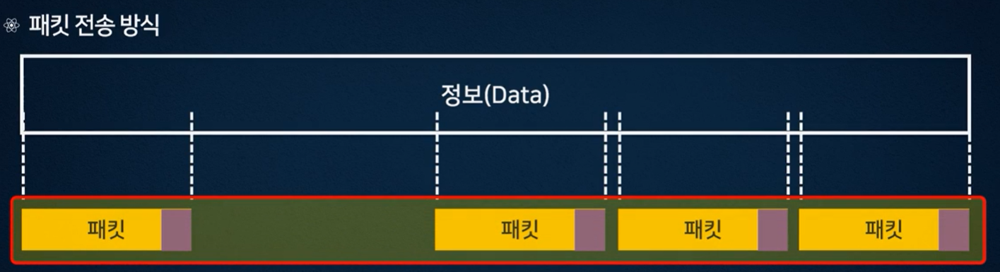
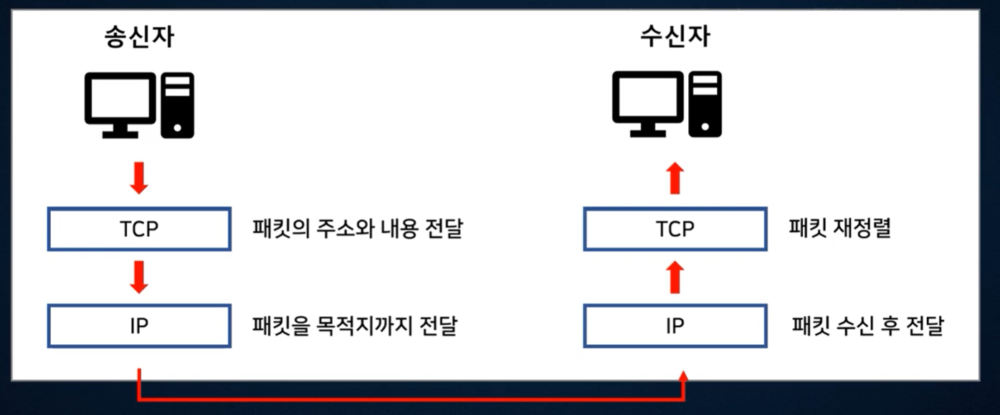
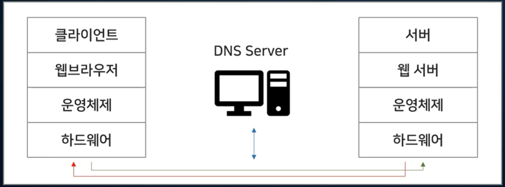

# 웹앱 기본 이해 & AWS와 educate 가입 & AWS EC2 서버 설치

Content: Week 2
Assignment: Yes
Lecture: Yes
STATUS: Note

# 인터넷과 웹앱 알아보기

## 인터넷의 정의와 역사

### 인터넷이란?

- 인터넷: Inter + Network
    - Network + Network
    - 정보 공유를 위해 컴퓨터와 통신망을 연결한 최대의 네트워크

### 인터넷의 역사

- 군사적 목적 → 학술적 목적 → 상업적 용도
    - ARPAnet: 1969년 미국 국방성
    - NSFnet: 1986년 미국 과학재단 슈퍼 컴퓨터의 연결, 인근의 대학, 도서관, 연구소 등을 연결
    - INTERnet: 1990년 이후 상업적 목적의 네트워크가 연결

## 인터넷 프로토콜

### 프로토콜이란?

- 컴퓨터나 통신 장비 사이에서 메시지를 주고 받는 양식과 규칙 체계
e.g. 사람과 사람 사이의 약속, Connection Request → Connection response 이 돌아오는 것

### 패킷 전송 방식이란?

- 큰 용량의 정보를 작은 단위의 패킷으로 나누어 전송하는 방법

### 프로토콜의 종류 - TCP

- TCP (Transmission Control Protocol): 송신자와 수신자 사이의 전송 단계에서 패킷의 주소와 내용을 담당을 프로토콜
- IP (Internet Protocol): 패킷을 목적지까지 보내는 규칙을 정의한 프로토콜, 절대 주소라고도 하며 숫자와 ‘.’로 구성됨 (유일한 숫자를 가지게 됨)
- 송신자가 데이터를 보내면 데이터는 패킷으로 나눠져 TCP로 전달 → TCP 계층은 패킷의 주소와 내용을 IP로 전달하는 역할 → IP는 전달 받은 패킷을 목적지까지 전달하는 역할 → 수신자의 IP 계층은 패킷을 수신 후 TCP 계층으로 전달 → 수신자의 TCP는 패킷을 재정렬하여 수신자에게 전달

## 웹의 정의와 구조

### 웹(web)이란?

- 웹 (WWW): World Wide Web의 줄임말
- 인터넷에 연결된 컴퓨터를 통해 사람들이 정보를 공유할 수 있는 전 세계적인 정보 공간
- 메일, 정보검색, 교육, 울트라넷으로 활용됨
- Web을 위한 프로토콜: HTTP

### 웹 접속 과정

- DNS: Domain Name System
    - 사용자가 알기 쉬운 **도메인**을 컴퓨터가 알기 쉬운 **IP** 주소로 변환하는 역할 (반대로 IP → 도메인 전환 역할도 하고 있음)
    - 클라이언트: 웹 브라우저 → 운영체제 → 하드웨어로 접속 요청을 보
    - DNS Server: 원하는 서버의 IP 주소로 변환
    - 서버: 하드웨어 → 운영체제 → 웹 서버 →index.html 파일을 찾아 다시 클라이언트에게 전송, 다시 사용자가 볼 수 있도록 웹 브라우저에 출력
    
    
    

### 웹의 동작

- 웹 브라우저를 통해 웹 서버에 접속하여 정보 획득 가능
- 브라우저: 인터넷 익스플로러, 크롬, 사파리 등 (브라우저 실행 → 웹 접속 → 웹 서버 정보 획득 → 결과 출력
- 웹 접속과 실행을 위해 프론트 엔드와 백 엔드의 역할이 필요

### 웹의 구성

- 프론트 엔드: 빙하의 노출된 부분, 웹의 외관적인 부분을 담당
    - HTML: 웹 페이지의 기본 구조 담당
    - CSS: 웹의 스타일을 담당
- 백엔드: 빙하의 숨겨진 부분, 웹의 데이터 베이스 관리, 서버 연동 등의 외관적으로 보이지 않는 부분을 담당
    - JavaScript: 웹 페이지의 동작 담당
    - Jquery, nodeJS: 자바스크립트의 기능을 활용
    - Cordova: 하이브리드 앱 개발

## 웹앱의 정의와 종류

### 웹앱이란?

- 모바일 기기 & PC를 통해 웹 브라우저를 통해서 실행되는 응용 프로그램을 총칭
    - **Hosted App**: 온라인 상태에서 URL 접속을 통해서 실행되는 웹앱
        - 실행에 필요한 웹 문서, 이미지 등이 모두 웹 서비스에서 서비스될 수 있어야 함
        - 장점: 웹서에 있는 내용만 고치면 되므로 유지보수가 간편
        - 단점: 항상 온라인이어야 ,모바일 기기의 API 사용에 제약
    - **Packaged App**: 실행에 필요한 모든 웹 문서와 파일들을 하나의 ZIP 파일로 압축하여 제공하는 웹앱
        - 앱 마켓에서 다운로드 받아 모바일 기기의 인증을 받아 설치되므로 온라인 상태의 웹 서버를 운영할 필요가 없음
        - 장점: local에서 사용되므로 다양한 API 사용 가능
        - 단점: 수정 사항 발생 시 다시 앱 마켓에 등록해야 하는 번거로움
    - **Native App:** 각각의 스마트폰 OS 환경에서 별도로 제공하는 프로그래밍 언어와 별도의 SDK를 이용해 제작된 앱
        - 프로그래밍 언어를 별도로 배워서 반드시 해당 OS 환경에서 제작해야 함
        - 장점: 앱 스토어에 등록할 수 있으므로 전 세계의 사용자가 쉽게 접속해 매할 수 있고,  스마트폰에 탑재해 모든 하드웨어 기능 사용가능
        - 단점: 앱 스토어에 개발자로 등록하여 연 회비를 지속적으로 지불해야하며, 웹앱에 해 업데이트가 복잡함

### 모바일 웹 (모바일 웹사이트)

- 데스크탑에서 실행되는 웹 어플리케이션을 모바일 스크린 크기로 축소해 놓은 것
- 일반적인 웹 기술로 개발되고 모바일 브라우저에서 실행되며, 풀 브라우징 방법으로 페이지를 이동하는 방식이기 때문에 속도가 느림
- 모바일 기기 이동 중 서버 접속 장애가 발생할 수 있어 불안정한 앱
- 현재 모바일 브라우저에서 볼 수 있는 대부분의 앱은 모바일 웹

### 모바일 웹앱

- 모바일 웹보다 모바일에 더 최적화 되고 네이티브 앱화됨 (모바일 웹의 특징 + 네이티브 앱의 특징)
- 일반적인 웹 기술로 개발되고 모바일 브라우저에서 실행되지만, 단일 페이지 모델을 사용하여 화면을 전환
- 모바일 웹보다 실행속도가 빠름

### 하이브리드 앱

- 네이티브 앱과 웹앱의 장점을 가지고 단점을 보완한 앱
- 외부 형태는 네이티브 앱이지만, 실제 내부는 모바일 웹앱으로 실행
e.g. 은행 어플리케이션