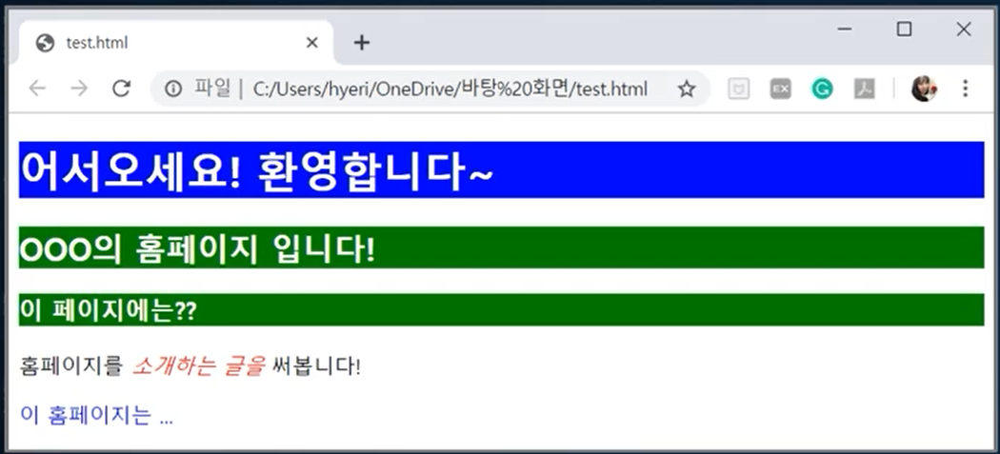
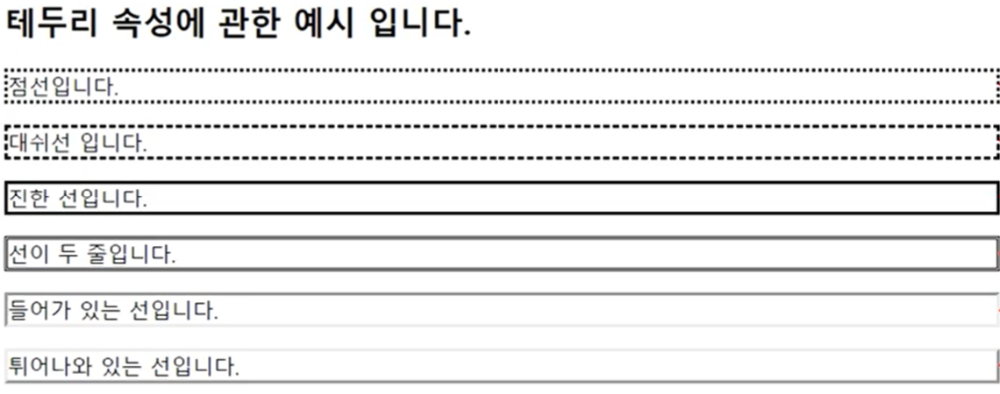
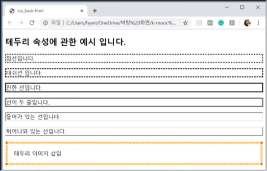

# 1회차 CSS 소개하기 2회차 CSS 기초 활용 3회차 CSS 고급 활용

Content: Week 6
Assignment: Yes
Lecture: Yes
STATUS: Note

# 1. CSS 소개하기

## 스타일 시트란?

### Style sheet (스타일 시트)

- 문서의 외형을 구체적으로 명시하기 위한 문장의 집합
- 웹 페이지 구성 요소에 크기, 색깔 등의 스타일을 일괄적으로 적용
- 글자 간격, 문단 간격, 위치 등 HTML 태그로는 제어할 수 없는 부분을 제어
- 문서의 구조와 스타일의 분리 → 파일을 구분하여 보기 좋음
- 스타일의 변경과 웹 페이지의 일관성 유지가 용이

### 스타일 시트 사용의 장점

- 문서의 내용에서 스타일 정보가 분리
- 똑같은 스타일 정보 반복 X
- 스타일 변경 시 스타일 정보만 바꿔주면 되므로 변경 용이

## 스타일 시트 종류

### 스타일 시트의 문법 종류

- CSS (Cascading Style Sheet)
    - 스타일 속성, 속성값으로 스타일 제어
    - `<style type = ‘text/css’>` (CSS가 표준이므로 <style>만 사용 가능)
- JSSS (Javascript Style Sheet)
    - Java script로 스타일 정보를 제어
    - `<style type = ‘text/Javascript’>`

## CSS란?

### CSS: cascading Style Sheets

- HTML 요소가 화면, 종이 또는 다른 매체에 표시되는 방법
- 한 번에 여러 웹페이지의 레이아웃 제
- 외부 스타일 시트는 CSS파일에 저장

## CSS의 형식

```css
h1 {color:blue; font-size:12px;}
```

### 선택자(selector)

- 스타일을 지정하고자 하는 HTML 태그, CLASS나 ID 이름
- 여러 태그에 동일한 속성 지정
    - 선택자에 같은 스타일을 지정하는 경우 태그 이름 콤마로 구분하여 나열
    e.g. `H1, H2 {background-color:navy}`

### 선언 (declaration)

- 속성(property)과 속성값(property value)으로 구성된 스타일 정보의 리스트
- 속성과 속성값은 콜론(:)으로 연결
- 하나의 태그에 여러 가지 속성 지정
    - 선언에 지정하고자 하는 속성들을 세미콜론으로 구분하여 나열
    e.g. `H3{background-color:navy; color:white}`

### 속성의 상속 (inheritance)

- 어떠한 태그에 지정된 속성은 그 안에 사용된 태그에도 적용됨
- 예: <P> 태그의 글자 색: 회색, <P><i> 태그 사용 시, <i>태그에 대해 회색으로 지정할 필요 없음

## 스타일 정보 삽입 방법

### 웹 페이지 <HEAD> 태그 내 정의

- <HEAD> 태그
    - <STYLE>이라는 태그를 이용해 스타일 정보 기술
- <STYLE> 태그
    - 웹 페이지에 스타일 정보를 포함시키는 역할
    - **<HEAD> 태그 내에서만 사용 가능**

```html
<!DOCTYPE html>
<html><head>
	<style>
		스타일 내용
	</style>
</head></html>
```

### 인라인(in-line) 스타일 정의

- BODY 부분에 사용된 태그 내에 속성으로 정의

```html
<!DOCTYPE html>
<html><head></head>
	<body>
		<p style='스타일 내용'></p>
	</body></html>
```

- <p>에 스타일 속성 추가

### 별도의 style sheet 삽입

- Style Sheet 문서의 URL로부터 스타일 정보를 읽어 웹 페이지에 적용

```html
<html>
	<head>
	<link rel="stylesheet" href = "URL">
	</head>
	<body></body>
</html>
```

## CSS 사용 예시

### <HEAD> 태그 내 정의

- <p> 태그를 이용하여 in-line 정의 → <style> 태그에 설정된 <p> 태그의 스타일보다 인라인 스타일에 우선적으로 반영됨

```html
<!DOCTYPE html>
<html><head><style>
	h1 {color: white; background-color: blue}
	h2, h3 {color:white; background-color: green}
	p{color: black; front-size:15}
	 </style> </head>
	<body>
		<h1> 어서오세요! 환영합니다~</h1>
		<h2> 000의 홈페이지입니다1</h2>
		<h3> 이 페이지에는?? </h3>
		<p> 홈페이지를 소개하는 글을 써봅니다!<P>
		<p style=color:red> 이 홈페이지는...</p>
	</body></html>
```

### <link>를 스타일 정의를 연결하기

1. style1.css 이름으로 새 파일 만들기
<style> 태그를 파일 안에 넣을 필요 없이 선택자와 선언부만 작성

```html
H1 {background-color: navy, color:white}
H2,H3 {background-color:green; color:white}
P {color:black, font-size:15}
```

1. style1.css 파일을 WinSCP 프로그램을 통해 /var/www/html에 업로드하여 웹에 게시
2. 다시 실습 파일(style_sheet.html)로 돌아와 <link> 태그 추가

```html
<!DOCTYPE html>
<html><head>
	<link rel="STYLESHEET" type="text/css" href="URL of style1.css">
	</head>
	<body>
		<h1> 어서오세요! 환영합니다~</h1>
		<h2> 000의 홈페이지입니다1</h2>
		<h3> 이 페이지에는?? </h3>
		<p> 홈페이지를 소개하는 글을 써봅니다!<P>
		<p style=color:red> 이 홈페이지는...</p>
	</body></html>
```

1. 웹페이지 업로드 후 실행

### 속성의 상속

- 선택자에 p i 태그 → 태그 안에 태그가 포함되어 있을 경우 태그 안에 있는 내용을 스타일 적용

```html
<!DOCTYPE html>
<html><head><style>
	h1 {color: white; background-color: blue}
	h2, h3 {color:white; background-color: green}
	p i{color: red; front-size:15}
	 </style> </head>
	<body>
		<h1> 어서오세요! 환영합니다~</h1>
		<h2> 000의 홈페이지입니다1</h2>
		<h3> 이 페이지에는?? </h3>
		<p> 홈페이지를 <i>소개하는 글을</i> 써봅니다!<P>
		<p style=color:red> 이 홈페이지는...</p>
	</body></html>
```

- 결과



# 2. CSS의 기초활용하기

## CSS 테두리

- 다음과 같이 head 태그에 p.으로 시작되는 선택자들을 추가
- <p> 태그에 하나의 스타일만 적용하지 않고 class 속성으로 설정하면 다양하게 스타일을 적용할 수 있음

```html
<!DOCTYPE html>
<html><head>
<style>
p.dotted {border-style: dotted;}
p.dashed {border-style: dashed;}
p.solid {border-style: solid;}
p.double {border-style: double;}
p.inset {border-style: inset;}
p.outset {border-style: outset;}
</style>
</head>
<body>

<h2> 테두리 속성에 관한 예시입니다. </h2>

<p class = 'dotted'> 점선입니다.</p>
<p class = 'dashed'> 대쉬입니다.</p>
<p class = 'solid'> 진한 선입니다.</p>
<p class = 'double'> 선이 두 줄입니다.</p>
<p class = 'inset'> 들어가 있는 선입니다.</p>
<p class = 'outset'> 튀어나와 있는 선입니다.</p>

</body></html>CSS
```



### CSS 테두리 이미지 삽입

```html
<!DOCTYPE html>
<html><head>
<style>
p.dotted {border-style: dotted;}
p.dashed {border-style: dashed;}
p.solid {border-style: solid;}
p.double {border-style: double;}
p.inset {border-style: inset;}
p.outset {border-style: outset;}

#borderimg {
	border: 10px solid transparent;
	padding: 15px;
	border-image: url(이미지 주소) 30 round;
}

</style>
</head>
<body>

<h2> 테두리 속성에 관한 예시입니다. </h2>

<p class = 'dotted'> 점선입니다.</p>
<p class = 'dashed'> 대쉬입니다.</p>
<p class = 'solid'> 진한 선입니다.</p>
<p class = 'double'> 선이 두 줄입니다.</p>
<p class = 'inset'> 들어가 있는 선입니다.</p>
<p class = 'outset'> 튀어나와 있는 선입니다.</p>
<p id="borderimg"> 테두리 이미지 삽입 </p>

</body></html>CSS
```



## CSS 높이와 너비